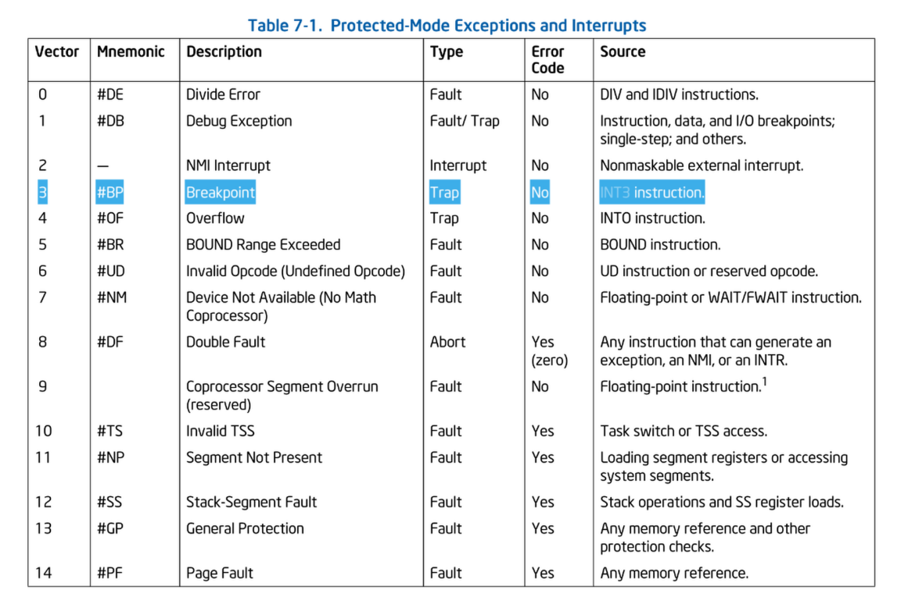
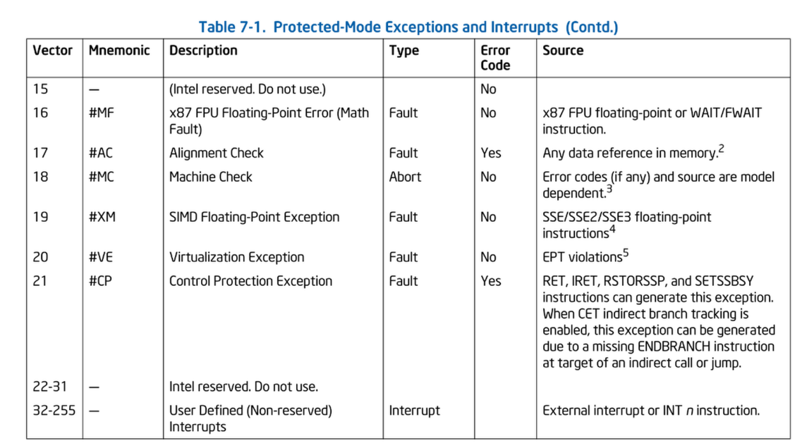

# TP2 - Les interruptions et les exceptions

Le but du TP est de bien comprendre les interruptions et les exceptions et
comment implémenter des gestionnaires.

## Rappels et prérequis théoriques

Niveau matériel, on a :

* Des informations stockées sur la pile lors de l’arrivée d’une interruption :
    * EFLAGS, CS, EIP, Error Code, seulement si pas de changement de niveau de
      privilèges
    * ESP et SS en supplément en cas de changement de niveau
* Le registre CPU IDTR à renseigner contenant une adresse à laquelle il
  s'attend trouver une table
* Une table de descripteurs d’interruption (IDT), pointeurs vers des routines
  à exécuter.

De son côté, l’OS doit au préalable :

* avoir implémenté des routines de traitement d’interruption
* les avoir référencées correctement dans une zone mémoire contenant une table
  de descripteurs d’interruption (IDT)
* avoir configuré le registre IDTR avec l'adresse de cette zone mémoire.

Dans ce TP, il pourra être utile de se référer à la documentation Intel pour
comprendre en détail ce que font les instructions suivantes et quel est leur
rôle : INT3, RET, IRET. Il pourra être également utile de savoir à quoi
correspond le numéro d'exception #6, ou savoir se servir des instructions
PUSH/PUSHA, POP/POPA.

> INT3 causes a breakpoint exception to be generated.

> RET (Return), permet le retour d'une fonction "normale", et restaure EIP de la pile.

Exemple :
```
call function    ; Push EIP sur la pile, jump vers function
...
ret             ; Pop EIP depuis la pile, jump vers cette adresse
```

> IRET (Interrupt Return), permet le retour d'interruption, qui restaure bcp plus d'informations depuis la pile (EIP, CS, EFLAGS (+ESP,SS si changement de ring)).




## Un premier squelette

Notre noyau dispose déjà d'une petite IDT. Elle est configurée dans
[intr.c](../kernel/core/intr.c) par la fonction `intr_init()`,  qui 
a notamment permis d'intercepter les #GP du TP1.

L'IDT contient des descripteurs d'interruptions `int_desc_t` qui sont
initialisés avec leur propre handler d'interruption `isr`.

La valeur d'isr correspond à des petites fonctions que l'on peut voir comme
des trampolines, localisées dans [`idt.s`](../kernel/core/idt.s). Ils servent
à empiler le numéro de l'interruption et à aligner la pile lorsqu'il manque
un code d'erreur pour l'évènement survenu. Chaque trampoline, saute dans
`idt_common` qui appelle le gestionnaire d'interruptions de haut niveau de
notre noyau `intr_hdlr`.

## Notes sur le tracing

Ce TP est également l'occasion d'utiliser les options de "trace" de Qemu,
permettant de savoir ce qu'il se passe dans le CPU durant l'exécution de la
VM.

Dans le fichier [`config.mk`](../utils/config.mk), il est possible
d'ajouter `$(QDBG)` sur la ligne de définition de QOPT, afin de faire prendre
en compte les options de trace au lancement de Qemu. Par défaut, seules
quelques traces sont activées, elles permettent de voir les exceptions
générées.

## Prise en main de l'IDT

**Q1\* : Dans tp.c, localiser l'IDT et afficher son adresse de chargement**
  (cf. fonction `get_idtr()` définie dans [`segmem.h`](../kernel/include/segmem.h)).

## Gestion furtive des breakpoints #BP

L'idée à présent est de compléter le contenu de l'IDT actuelle, notamment pour
qu'elle puisse gérer l'exception #BP. Le but est de ne pas modifier
`intr_hdlr` mais d'intercepter les #BP en amont depuis [`tp.c`](./tp.c).

### Premier essai naïf : sous forme d'une simple fonction C

**Q2 : Dans [`tp.c`](./tp.c), commencer par écrire une routine de traitement
  dans une fonction, `bp_handler`, affichant un message de debug à
  l'écran.**

**Q3 : Modifier le descripteur d'interruption (cf. type `int_desc_t` défini 
  dans [`segmem.h`](../kernel/include/segmem.h)) de #BP, stocké
  dans l'IDT, afin d'y référencer `bp_handler()` à la place du trampoline
  déjà installé.**

**Q4 : Pour tester cette mise à jour, ajouter une fonction `bp_trigger`, dans
  [`tp.c`](./tp.c), déclenchant un breakpoint grâce à l'instruction `int3` et
  appeler `bp_trigger()` dans `tp()`.**

**Après execution dans le terminal :**
```
Debut Q1
IDTR base adress : 0x304ec0
Fin Q1
Debut Q3
Fin Q3
Debut trigger Q4
     0: v=03 e=0000 i=1 cpl=0 IP=0008:00303fb4 pc=00303fb4 SP=0010:00301fc0 env->regs[R_EAX]=00000012
EAX=00000012 EBX=00000030 ECX=00304ac0 EDX=00000011
ESI=0002bfc2 EDI=0002bfc3 EBP=00301fc8 ESP=00301fc0
EIP=00303fb4 EFL=00000006 [-----P-] CPL=0 II=0 A20=1 SMM=0 HLT=0
ES =0010 00000000 ffffffff 00cf9300 DPL=0 DS   [-WA]
CS =0008 00000000 ffffffff 00cf9a00 DPL=0 CS32 [-R-]
SS =0010 00000000 ffffffff 00cf9300 DPL=0 DS   [-WA]
DS =0010 00000000 ffffffff 00cf9300 DPL=0 DS   [-WA]
FS =0010 00000000 ffffffff 00cf9300 DPL=0 DS   [-WA]
GS =0010 00000000 ffffffff 00cf9300 DPL=0 DS   [-WA]
LDT=0000 00000000 0000ffff 00008200 DPL=0 LDT
TR =0000 00000000 0000ffff 00008b00 DPL=0 TSS32-busy
GDT=     00008f8c 00000027
IDT=     00304ec0 000007ff
CR0=00000011 CR2=00000000 CR3=00000000 CR4=00000000
DR0=00000000 DR1=00000000 DR2=00000000 DR3=00000000 
DR6=ffff0ff0 DR7=00000400
CCS=00000010 CCD=00301fc0 CCO=ADDL
EFER=0000000000000000
Debut handler Q2
#BP handling
Fin handler Q2
Fin trigger Q4
```

**Q5 : Cette implémentation pousse le CPU à générer une faute. Pour comprendre
  pourquoi, à l'aide d'un outil de désassemblage comme `objdump -D`, lister
  les instructions, générées à la compilation, de la fonction `bp_handler()`. 
  Quelle est la dernière instruction de cette fonction ? Quel est son
  impact sur la pile ? Est-ce cohérent avec ce qui était sur la pile au
  moment de l'arrivée d'une interruption ?**

```bash
(base) > objdump -D tp.o | grep -A 10 -B 2 bp_handler
00000000 <bp_handler>:
   0:   55                      push   %ebp
   1:   89 e5                   mov    %esp,%ebp
   3:   83 ec 08                sub    $0x8,%esp
   6:   83 ec 0c                sub    $0xc,%esp
   9:   68 00 00 00 00          push   $0x0
   e:   e8 fc ff ff ff          call   f <bp_handler+0xf>
  13:   83 c4 10                add    $0x10,%esp
  16:   83 ec 0c                sub    $0xc,%esp
  19:   68 12 00 00 00          push   $0x12
  1e:   e8 fc ff ff ff          call   1f <bp_handler+0x1f>
  23:   83 c4 10                add    $0x10,%esp
  26:   83 ec 0c                sub    $0xc,%esp
  29:   68 20 00 00 00          push   $0x20
  2e:   e8 fc ff ff ff          call   2f <bp_handler+0x2f>
  33:   83 c4 10                add    $0x10,%esp
  36:   90                      nop
  37:   c9                      leave
  38:   c3                      ret

00000039 <bp_trigger>:
  39:   55                      push   %ebp
  3a:   89 e5                   mov    %esp,%ebp
  3c:   83 ec 08                sub    $0x8,%esp
  3f:   83 ec 0c                sub    $0xc,%esp
```
**Analyse du désassemblage :**

La fonction `bp_handler` se termine par deux instructions :
- `37: c9    leave`  (équivalent à `mov %ebp, %esp; pop %ebp`)
- `38: c3    ret`    (pop EIP depuis la pile et jump)

**Problème identifié :**
Lorsque le compilateur traite `bp_handler` comme une fonction C classique, il génère automatiquement l'instruction `ret` pour le retour. Cependant, lors d'une interruption, le CPU empile automatiquement sur la pile :
- **EFLAGS** (ESP+8)
- **CS** (ESP+4) 
- **EIP** (ESP+0)

L'instruction `ret` ne restaure que **EIP** depuis la pile, laissant **CS** et **EFLAGS** non traités, ce qui provoque un déséquilibre de pile et génère une faute.

**Incohérence :**
- **Attendu** : `iret` qui restaure EIP, CS et EFLAGS
- **Généré** : `ret` qui ne restaure que EIP

**Solution :** Utiliser l'assembleur inline avec `iret` au lieu de laisser le compilateur générer `ret`.

### Deuxième essai : via l'assembleur inline

L'idée est de réécrire `bp_handler` en assembleur inline pour éviter l'écueil
de l'essai précédent.

**Q7 : Au début de `bp_handler`, afficher la valeur stockée en `ebp-4` :**

```c
  uint32_t val;
   asm volatile ("mov 4(%%ebp), %0":"=r"(val));
```

**Quelle signification cette valeur a-t-elle ? S'aider à nouveau de `objdump -D`
pour comparer cette valeur à une adresse de votre noyau.**

La valeur récupérée à `ebp-4` est `0x303f9e`.
```
(base) >  objdump -D kernel.elf | grep -B 5 -A 5 "303f9e
...
  303f9a:       83 c4 10                add    $0x10,%esp
  303f9d:       cc                      int3
  303f9e:       83 ec 0c                sub    $0xc,%esp
  303fa1:       68 80 49 30 00          push   $0x304980
...
  ```
On remarque que cette valeur est une adresse qui suit l'instruction int3. Donc nous somme dans la fonction bp_trigger.

**Q8\* : Qu'est-ce qui n'est pas stocké par le CPU à l'arrivée d'une
  interruption et qu'il est impératif de sauvegarder avant tout traitement de
  l'interruption ? L'implémenter en assembleur inline dans  `bp_handler`.**

  Le CPU ne sauvegarde pas automatiquement les registres généraux (EAX, EBX, ECX, EDX, ESI, EDI, EBP, etc.) lors d'une interruption. Il est donc impératif de les sauvegarder manuellement au début du gestionnaire d'interruption pour éviter qu'ils ne soient écrasés par le traitement de l'interruption.

  Exemple d'implémentation en assembleur inline dans `bp_handler` :

  ```c
  asm volatile (
    "pusha\n\t"   // Sauvegarde tous les registres généraux sur la pile
  );
  ```

**Q9\* : Par quelle instruction doit se terminer la routine pour que le noyau
  rende la main à la fonction tp() ? L'implémenter en assembleur inline dans
  `bp_handler`.**

```c
asm volatile ("popa");
asm volatile ("leave; iret");
```

**Q10 : Tester que le retour du traitement de l'interruption s'est effectué
  correctement en affichant un message de debug dans la fonction `bp_trigger()` 
  après le déclenchement du breakpoint.**

Nous avons bien `Fin trigger Q4` qui s'effectue après `#BP handling`.
```
EFER=0000000000000000
#BP handling
EIP = 303fb2
Fin trigger Q4
```

**Q11 : Quelles conclusions peut-on tirer du développement en C d'un
  gestionnaire d'interruption ? Pourquoi l'assembleur semble-t-il plus
  approprié ?**

Le développement en C rajoute les frames de fonction non désirées...