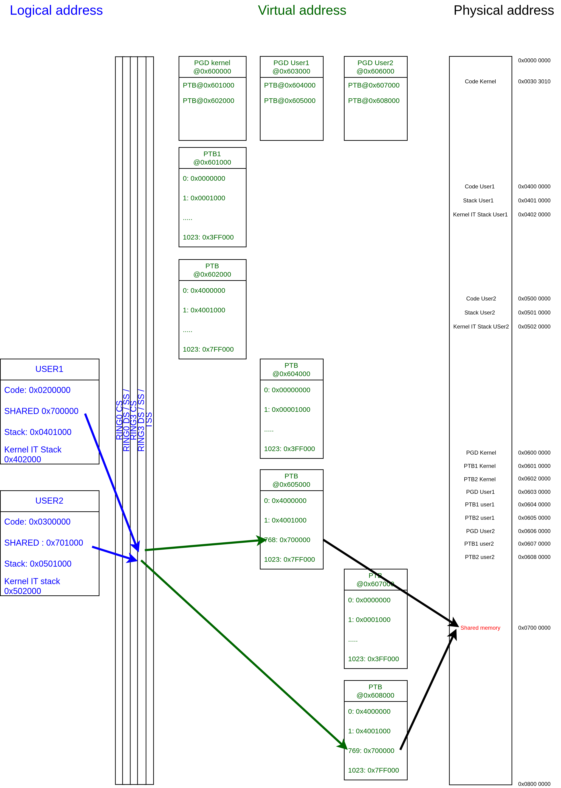

# Cartographie mémoire — TP Examen SecOS

### Exécution et debug

1. Se placer dans le répertoire tp_exam :
```bash
cd secos-ng/tp_exam
```

2. Lancer QEMU :
```bash
make qemu QDBG=
```

3. Pour observer clairement la différence entre user1 et user2 :
- Décommenter les lignes de debug dans `void user1()` et `void user2()` (elles le sont déjà).

## Vue physique (adresses importantes)
- `0x000000` - `0x003FFFFF` : zone 0..4MB — identity-mappée (PTB / PDE[0])
- `0x400000` - `0x7FFFFF` : zone 4..8MB — identity-mappée (PTB2 / PDE[1])
- `0x600000` : PGD du noyau (physique)
- `0x601000` : PTB (kernel) pour 0..4MB
- `0x602000` : PTB2 (kernel) pour 4..8MB
- `0x603000` : PGD de la seconde tâche utilisateur (user PGD)
- `0x604000` : PTB de la seconde tâche (user PTB 0..4MB)
- `0x605000` : PTB2 de la seconde tâche (user PTB2 4..8MB)
- `0x700000` : page physique partagée (physique)
- `0x401000`, `0x501000` : pages choisies pour les stacks utilisateurs (ex. user1/user2)
- `0x402000`, `0x502000` : pages réservées comme stacks noyau (kstack)

## Conventions de paging / CR3
- Les entrées PDE/PTE stockent la frame phys (phys >> 12) dans le champ `addr`.
- `Task_Context[i].cr3` contient l'adresse physique complète du PGD (ex. `0x600000` ou `0x603000`).
- `set_cr3()` est appelé avec une structure `cr3_reg_t` dont `addr = (phys >> 12)` :
	- Exemple : `newCR3.addr = (uint32_t)Task_Context[n].cr3 >> 12; set_cr3(newCR3);`

## Mappages virtuels (vue logique pour chaque tâche)
- Les deux tâches ont un mapping virtuel identique pour 0..8MB (identity mapping des pages), mais leurs tables de pages (PGD/PTB) résident physiquement à des endroits différents (`0x600000` vs `0x603000`).
- La page partagée : phys `0x700000` est mappée virtuellement pour chaque tâche à des adresses virtuelles différentes (`0x700000` pour task A, `0x701000` pour task B dans l'exemple).

## Schéma du mappage mémoire
